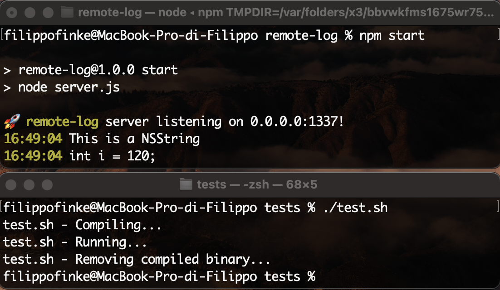

# Remote Log

Tool that allows you to read debug messages from your tweaks remotly.

## Installation

- Move RemoteLog.h into your theos/includes folder
- Run `npm i`

## Usage

- Define your computer IP `#define REMOTE_LOG_IP "127.0.0.1"`
- Start the server `npm start`

## Examples

- Test file [main.m](/tests/main.m)

## Screenshot

